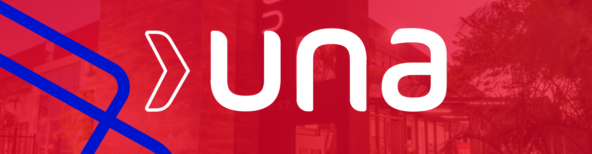
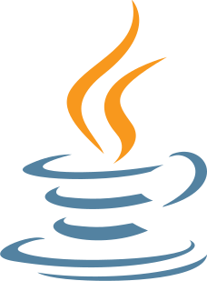
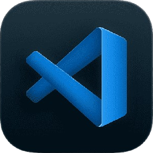

# 🎓 Algoritmos e Técnicas de Programação: 1°/2023

Este repositório contém todos os códigos e estudos desenvolvidos durante o primeiro período da faculdade UNA de Cinência da Computação.

## 📌 Conteúdos e Categorias

| Categoria | Descrição |
| :--- | :---:|
| **Exercícios** | Listas de fixação avaliativas|
| **Extras** | Desafios e revisões |
| **Prova** | Resolução da avalição prática |

## 🧠 Conceitos Consolidados

Durante este semestre, explorei os pilares fundamentais da programação:

* **Lógica de Programação:** Desenvolvimento do raciocínio algorítmico.
* **Estruturas de Controle:** Domínio de condicionais (`If/Else`, `Switch`) e laços de repetição (`While`, `For`).
* **Manipulação de Dados:** Trabalho com variáveis, constantes e tipos primitivos.
* **Estruturas Compostas:** Implementação e uso de Vetores e Matrizes (Arrays).
* **Modularização:** Criação de funções e procedimentos para organização de código (Introdução POO).

## 🛠️ Tecnologias de Estudo

* **Linguagem Principal:**  Java
* **Ferramentas Utilizadas:**  Visual Studio Code (VS Code)

---
*Desenvolvido por Felipe Claver Diniz*
